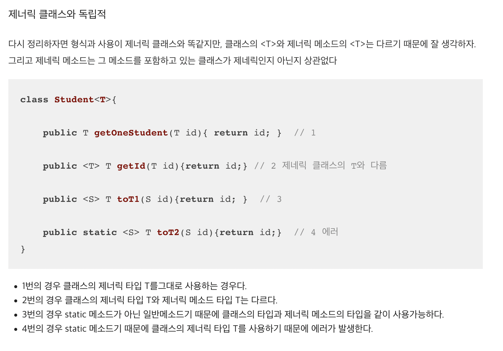

## 생성자 대신 정적 팩터리 메서드를 고려하라
- 우리가 클래스의 인스턴스를 얻는 전통적인 수단은 `public` 생성자다
- 꼭 알아야 할 기법이 하나 더 있는데 이것이, `정적 팩터리 메서드`이다

``` java
public static Boolean valueOf(boolean b) {
  return b ? Boolean.TRUE : Boolean.FALSE;
}
```

---------------

- ### 장점
  1. **이름을 가질 수 있다**
      - `BigInteger.probablePrime` -> 값이 소수인 BigInteger를 반환한다
  2. **호출될 때마다 인스턴스를 새로 생성하지는 않아도 된다**
      - 인스턴스를 미리 만들어 놓거나 새로 생성한 인스턴스를 **캐싱**하여<br> 재활용하는 식으로 불필요한 객체 생성을 피할 수 있다 -> Enum활용하면 좋다
      - 불변클래스
        - `String`, `Boolean`, `Integer`등 -> 레퍼런스타입의 객체로 `heap`영역에 생성된다
  3. **반환타입의 하위 타입 객체를 반환할 수 있는 능력이 있다**
      - 3번의 경우는 코드를 통해 확인하는것이 더 효과적이다
      ``` java
      public static <T> List<T> unmodifableList(List <? extends T> list) {
        if (list.getClass() == UnmodifiableList.class || list.getClass() == UnmodifiableRandomAccessList.class) {
          return (List<T>) list;
        }

        return (list instanceof RandomAccess ? new UnmodifiableRandomAccessList<>(list) : new UnmodifiableList<>(list));
      }
      ```
        - `Collections` 내부의 정적 팩터리 메서드중 하나를 추출한 것
        - 공부하던 중 제네릭에 대해 더 알아본것 첨부

          

  4. **입력 매개변수에 따라 매번 다른 클래스의 객체를 반환할 수 있다.**
        ``` java
        public static <E extends Enum<E>> EnumSet<E> noneOf(Class<E> elementType) {
          Enum<?>[] universe = getUniverse(elementType);
          if (universe == null)
            throw new ClassCastException(elementType + " not an enum");

          if (universe.length <= 64)
            return new RegularEnumSet<>(elementType, universe);
          else
            return new JumboEnumSet<>(elementType, universe);
        }
        ```

  5. **정적 팩터리 메서드를 작성하는 시점에는 반환할 객체의 클래스가 존재하지 않아도 된다**
        - 인터페이스나 클래스가 만들어지는 시점에서 하위 타입의 클래스가 존재하지 않아도 나중에 만들 클래스가 <br> 기존의 인터페이스나 클래스를 상속 받으면 언제든지 의존성을 주입 받아서 사용가능하다. 
        - 반환값이 인터페이스가 되며 정적 팩터리 메서드이 변경없이 구현체를 바꿔 끼울 수 있다.


- ### 단점
  1. **상속을 하려면 public이나 protected 생성자가 필요하니<br> 정적 팩터리 메서드만 제공하면 하위 클래스를 만들 수 없다**
    - 어찌보면 이 제약은 상속보다 컴포지션(`구성`)을 사용하도록 유도하고<br> 불변타입으로 만들려면 이 제약을 지켜야 한다는 점에서 오히려 장점이다
  2. **정적팩터리 메서드는 프로그래머가 찾기 어렵다.**

------------------

## 핵심정리
  - 정적팩터리를 사용하는게 유리한 경우가 더 많으므로 무작정 `public 생성자`를 제공하던 습관이 있다면 고치자