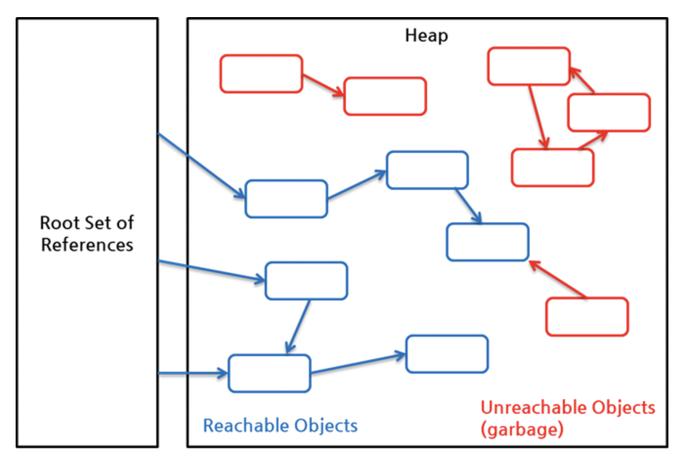

## 다 쓴 객체 참조를 해제하라


- ### 가비지 컬렉터만 믿고 메모리 관리에 신경을 쓰지 않으면 안된다.
  ``` java
  public class Stack {
    private Object[] elements;
    private int size = 0;
    private static final int DEFAULT_INITIAL_CAPACITY = 16;

    public Stack() {
        elements = new Object[DEFAULT_INITIAL_CAPACITY];
    }

    public void push(Object e) {
        ensureCapacity();
        elements[size++] = e;
    }

    public Object pop() {
        if (size == 0)
            throw new EmptyStackException();
        return elements[--size];
    }

    /**
     * 원소를 위한 공간을 적어도 하나 이상 확보한다.
     * 배열 크기를 늘려야 할 때마다 대략 두 배씩 늘린다.
     */
    private void ensureCapacity() {
        if (elements.length == size)
            elements = Arrays.copyOf(elements, 2 * size + 1);
    }

  }
  ```
  - 오래 실행하다 보면 점차 가비지 컬렉션 활동과 메모리 사용량이 늘어나 결국 성능이 저하된다
  - 위 코드에서는 스택이 커졌다가 줄어들 때 스텍에서 꺼내진 **객체들을 가비지 컬렉터가 회수하지 않는다**
    - 이 스택이 그 객체들의 다 쓴 참조를 여전히 가지고 있기 때문에
  - `가비지 컬렉션 언어(ex: Java)`에서는 메모리 누수를 찾기가 아주 까다롭다
    - **객체 참조 하나를 살려두면 가비지 컬렉터는 그 객체뿐 아니라 그 객체가 참조하는 모든 객체를 회수해가지 못한다**<br>(밑의 그림 참고 : 화살표가 이어지므로)
    - 그래서 단 몇개의 객체가 매우 많은 객체를 회수되지 못하게 할 수 있다

  - ### 가비지 컬렉션

    

  - **역할**
    - 힙(Heap) 내의 객체 중 Garbage를 찾아낸다.
    - 찾아낸 Garbage 객체를 반환하여 메모리를 회수한다.
  - **과정**
    - 객체들은 일단 생성되면 위 그림과 같이 힙 영역에 생성된다
    - 힙에 새로운 객체를 생성했을 때 공간이 부족하다면 `JVM`은 `Out of MemoryGC`을 뿌리게 된다
    - GC는 Root Set of References(유효한 최초의 참조)가 이루어지지 않는 객체 Unrechable Objects들을 수거한다
    > GC는 객체를 메모리에서 제거하기 전에 해당 객체의 finalize( ) 메소드를 호출한다 <br>이렇게 보면 GC를 자주 호출해주어 불필요한 메모리를 제거해주고 싶지만 <br>안타깝게도 GC는 사용자가 강제로 수행할 수 없다 언제 일어나는지도 정확히 알 수 없다

  - **대상**(GC 대상이 되는 객체)
    - 모든 객체의 참조가 모두 null일 경우 GC 대상이 된다
    - 하지만 원형참조(A가 B를 B가 A를 참조하는 형태`=순환참조`)인 경우에는 참조로 간주하지 않는다`(위 그림 참고)`<br> **수거하지 않는다**
    - 객체 A, B에 다른 살아있는 객체의 참조가 없다면 또한 GC의 대상
    1. 모든 객체 참조가 null 인 경우
    2. 객체가 블럭 안에서 생성되고 블럭이 종료된 경우(`함수`)
    3. 부모 객체가 null이 된 경우, 자식 객체는 자동적으로 GC 대상이 된다.
    4. 객체가 `Weak` 참조만 가지고 있을 경우
    5. 객체가 `Soft` 참조이지만 메모리 부족이 발생한 경우

  - **알고리즘**
    - 가비지 컬렉션의 주요한 알고리즘에는 **트레이싱 방법(mark and sweep)**, 과 **레퍼런스 카운팅 방법(Reference-counting)** 이 있다.
    - **Reference-counting**
      - 한 객체를 참조하는 레퍼런스의 수를 추적하여 센다.
      - 처음에는 특정 할당된 메모리 부분에 대해서 레퍼런스의 숫자가 하나지만, 변수가 복사될수록 레퍼런스의 카운트는 늘어난다.
      - 변수의 값이 바뀌거나 변수 스코프를 벗어나면, 레퍼런스 카운트의 값은 줄어든다.
      - 레퍼런스 카운트가 0이 되면, 해당 메모리 값을 참조하는 객체는 없는 것이므로 **할당 해제**한다.
        - 어떤 객체도 해당 메모리 값에 대해서 레퍼런스를 가지지 않는 상태

      - 하지만, 만약 두 객체가 서로를 참조한다고 하면 실제 이 두 객체가 사용되지 않아도 레퍼런스 카운트는 1에서 더 이상 내려가지 않는다.
        - 때문에, 메모리의 누수가 발생할 수 있다. **이를 순환 참조(circular references)라고 한다.**
  - ### Java의 3가지 유형의 참조
    - **강한 참조**
      - `Integer prime = 1;`와 같은 가장 일반적인 참조 유형
      - `prime` 변수 는 값이 `1 인 Integer` 객체에 대한 강한 참조 를가진다 
      - 이 객체를 가리키는 강한 참조가 있는 객체는 GC대상이 되지않는다.
    - **부드러운 참조**
      - `SoftReference<Integer> soft = new SoftReference<Integer>(prime);` 와 같이 `SoftReference Class`를 이용하여 생성이 가능하다
      - 만약 `prime == null` 상태가 되어 더이상 원본(최초 생성 시점에 이용 대상이 되었던 `Strong Reference` -> `prime`) 은 없고 대상을 참조하는 객체가 `SoftReference`만 존재할 경우 GC대상으로 들어가도록 JVM은 동작한다
      - 다만 `WeakReference` 와의 차이점은 메모리가 부족하지 않으면 굳이 GC하지 않는 점이다
      - 때문에 조금은 엄격하지 않은 `Cache Library`들에서 널리 사용되는 것으로 알려져있다
    - **약한 참조**
      - `WeakReference<Integer> soft = new WeakReference<Integer>(prime);`와 같이 `WeakReference Class`를 이용하여 생성이 가능하다
      - `prime == null` 되면 (해당 객체를 가리키는 참조가 `WeakReference` 뿐일 경우) GC 대상이 된다
      - 앞서 이야기 한 내용과 같이 `SoftReference와` 차이점은 메모리가 부족하지 않더라도 GC 대상이 된다는 것이다

  - **해결법**
    - 해당 참조를 다 썼을 때 `null`처리(참조 해제)하면 된다
    ``` java
    public Object pop(){
      if(size==0){
        throw new EmptyStack Exception();
      }
      Object result = elements[--size];
      elements[size] = null;
      return result;
    }
    ```
    - 만약 `null`처리한 참조를 실수로 사용하려 하면 프로그램은 즉시 `NullPointerException`을 던져 오류를 조기에 발견 가능하다
    - **하지만, 객체 참조를 `null`처리하는 일은 예외적인 경우여야 한다**

- ### 메모리 누수를 일으키는 원인들
  - ### 메모리 직접 관리
    - `Stack`이 자기 메모리를 직접 관리하기 때문에 메모리 누수에 주의해야 한다
    - 가비지 컬렉터는 배열의 어떤 영역이 활성영역인지, 비활성 영역인지 알 길이 없다<br> 가비지 컬렉터가 보기에는 비활성 영역에서 참조하는 객체도 똑같이 유효한 객체이다
    - **그러므로, 프로그래머는 비활성 영역이 되는 순간 null 처리해<br> 해당 객체를 더는 쓰지 않을 것임을 가비지 컬렉터에게 알려야 한다**
  
  - ### 캐시
    - 객체 참조를 캐시에 넣고 나서, 이사실을 까맣게 잊은 채 그 객체를 다 쓴 뒤로도 한참을 그냥 놔두는 일을 자주 접할 수 있다
    ``` java
    Object key1 = new Object();
    Object value1 = new Object();

    Map<Object, List> cache = new HashMap<>();
    cache.put(key1, value1);
    ```
    > key1이 사라지면 캐싱 자체가 무의미해진다
    - **해결법**
      - 캐시 외부에서 키를 참조하는 동안만 엔트리가 살아 있는 캐시가 필요한 상황이라면 <br>`WeakHashMap`을 사용해 캐시를 만들자.
      - 다 쓴 엔트리는 자동으로 제거된다
      ``` java
      Object key1 = new Object();
      Object value1 = new Object();

      Map<Object, List> cache = new WeakHashMap<>();
      cache.put(key1, value1);
      ```
    - 캐시를 만들 때 보통은 캐시 엔트리의 유효기간을 정확히 정의하기 어렵기 때문에 <br>시간이 지날수록 엔트리의 가치를 떨어뜨리는 방식을 흔히 사용한다 
      - 이런 방식에서는 쓰지 않는 엔트리를 이따금 청소해주어야 한다

  - ### 리스너 혹은 콜백
    - 콜백(`함수가 끝나고 난뒤에 실행되는 함수`)을 등록만 하고 명확히 해지하지는 않는다
    - 콜백을 `약한참조`로 저장하면 가비지 컬렉터가 즉시 수거해 간다


--------------

- ## 핵심정리
  - **가비지 컬렉터가 있더라도 메모리 관리에 신경을 써야한다**
  - 메모리 누수를 일으키는 유형(여기서는 3가지)을 배우고 해결법을 알아놓자.