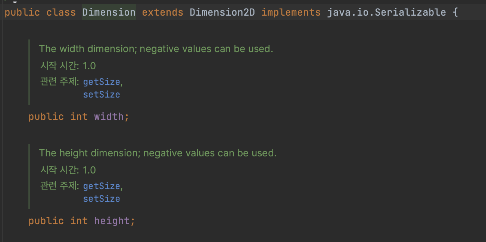
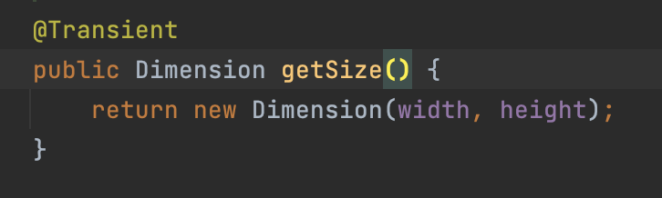
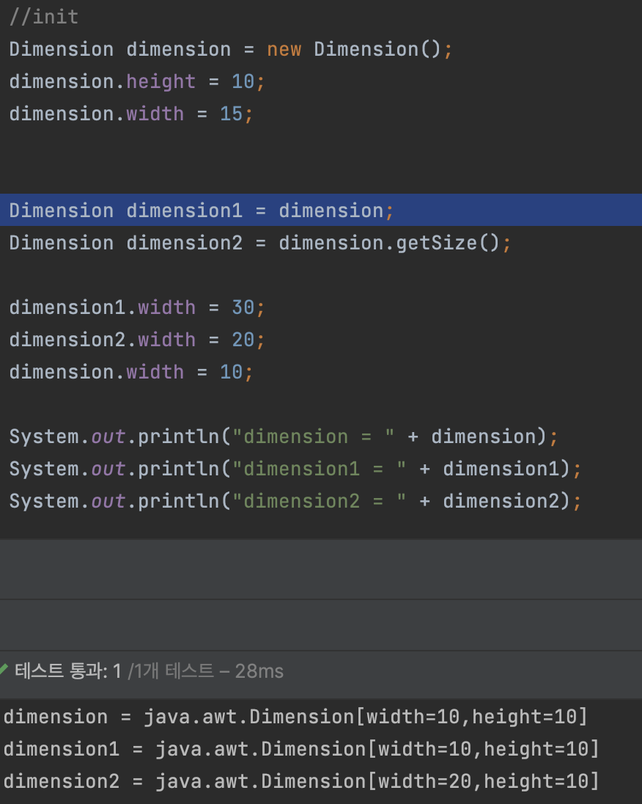

# public클래스에는 public필드가 아닌 접근자 메서드를 사용하라
``` java
//엉망진창의 클래스
public class Point{
  public double x;
  public double y;
}
```
- 캡슐화의 이점제공 x
- API를 수정하지 않고는 내부 표현을 바꿀 수 없다
- 불변식을 보장하지 않는다
> 객체지향적이지 않다


## public class의 경우
``` java
public class Point {
	private int x;
	private int y;

	public Point(int x, int y) {
		this.x = x;
		this.y = y;
	}

	public int getX() { return x; }
	public int getY() { return y; }

	public void setX(int x) { this.x = x; }
	public void setY(int y) { this.y = y; }
}
// 접근자를 제공하면서 유연성이 증가
```


## default 클래스 혹은 private 중첩 클래스의 경우
- **public** 클래스와 다르게 데이터 필드를 노출해도 크게 문제가 없다
``` java
public class TopPoint {
	private static class Point {
		public double x;
		public double y;
	}

	public Point getPoint() {
		Point point = new Point();
		point.x = 3.5;
		point.y = 4.5;
		return point;
	}
}
// 캡슐화의 이점 제공(분리)
// API수정 없이 내부 변경 가능 -> getter, setter 이용으로 가능
// 클라이언트가 직접 필드에 접근해서 값을 변경하기가 불가능하다 -> 불변식 보장
```

## 자바 플랫폼 라이브러리에서 public 클래스의 필드를 직접 노출하지 말라는 규칙을 어기는 사례
  - **Dimension class**

    

    

    

  - Dimension 클래스의 필드는 가변으로 설계되어
  - getSize 를 호출하는 모든 곳에서 방어적 복사를 위해 인스턴스를 새로 생성해야 함 **-> 쓰레드세이프 하기 위해**
  > 방어적 복사<br>
    방어적 복사를 사용할 경우, 외부에서 객체를 변경해도 내부의 객체는 변경되지 않는다.


## 불변필드를 노출한 public 클래스
``` java
public class Time {
	private static final int HOURS_PER_DAY = 24;
	private static final int MINUTES_PER_HOUR = 60;

	public final int hour;
	public final int minute;

	public Time(int hour, int minute) {
		if (hour < 0 || hour > HOURS_PER_DAY) {
			throw new IllegalArgumentException("시간: " + hour);
		}
		if (minute < 0 || minute > MINUTES_PER_HOUR) {
			throw new IllegalArgumentException("분: " + minute);
		}
		this.hour = hour;
		this.minute = minute;
	}

	...
}
```
- 불변식만 보장할 수 있다
  - 각 인스턴스가 유효한 시간을 표현함을 보장함


-------------


## 핵심정리
- `public` 클래스는 절대 가변필드를 노출하면 안된다
  - 불변필드라면 노출해도 덜 위험하지만 안심할 수 없다
- `default나` `private중첩 클래스`는 종종 필드를 노출하는 편이 낫긴하다(추상적으로 깔끔)
