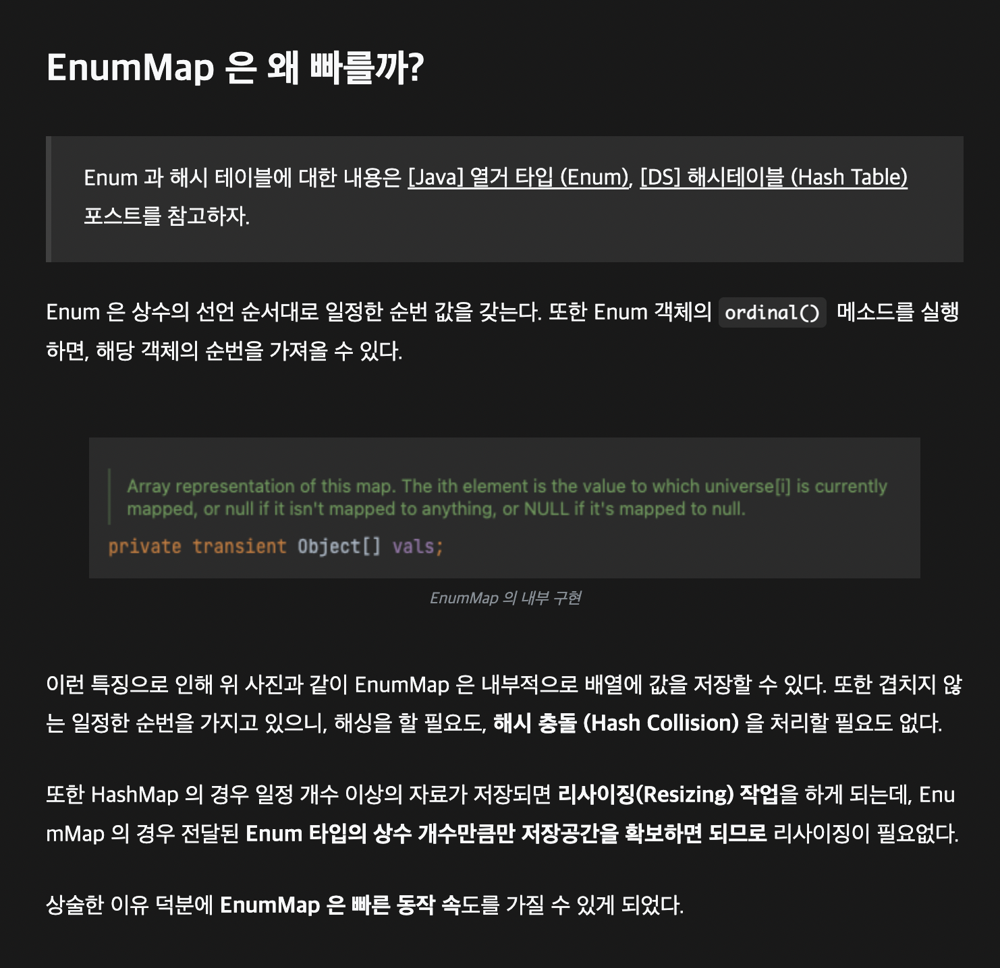

# ordinal 인덱싱 대신 EnumMap을 사용하라

## 결론

- **Enum**의 **ordinal()** 은 `EnumMap`과 같은 클래스를 구현하기 위해서 존재한다는 말이 있을 정도로 실제로 잘 사용하지 않는 것을 권고한단다.
- **Enum** 값을 통해서 자료를 구성할 때 **ordinal()** 을 활용해서 인덱스로 배열을 접근하는 방식으로 하는 것보다는 이미 내부적으로 구현하고 있는 **EnumMap**을 사용하는 것이 훨씬 좋다



<aside>

📌 **EnumMap**

: **Key 값을 Enum으로 받아서 유일성이 보장, Key값을 배열로 받아서 추가적인 연산이 없다**

**HashMap**
: Hash연산같이 추가적인 연산이 필요하다

</aside>

### Enum Rank

```java
public enum Rank {

    MISS(0, 0, "3개 미만 일치"),
    FIFTH(3, 5_000, "3개 일치"),
    FOURTH(4, 50_000, "4개 일치"),
    THIRD(5, 1_500_000, "5개 일치"),
    SECOND(5, 30_000_000, "5개 일치, 보너스 볼 일치"),
    FIRST(6, 2_000_000_000, "6개 일치");

    private final int matchCount;
    private final int reward;
    private final String matchStatus;

    Rank(final int matchCount, final int reward, final String matchStatus) {
        this.matchCount = matchCount;
        this.reward = reward;
        this.matchStatus = matchStatus;
}
```

### Lotto

```java
public class Lotto {

    public Rank rank;

    public Lotto(Rank rank) {
        this.rank = rank;
    }

    public Rank getRank() {
        return rank;
    }

    @Override
    public String toString() {
        return "Lotto{" +
                "rank=" + rank +
                '}';
    }
}
```

### lotteries

```java
List<Lotto> lotteries = new ArrayList<>();
lotteries.add(new Lotto(Rank.FIRST));
lotteries.add(new Lotto(Rank.SECOND));
lotteries.add(new Lotto(Rank.THIRD));
```

## `ordinal()` 활용한 배열

### 특징

- 배열은 각 인덱스의 의미를 모르니 출력결과 에 직접 레이블을 달아야 한다
- 정수는 열거타입과 달리 타입안전하지 않다
- 정수 타입을 사용하여 접근하기 때문에 잘못된 값을 사용하면 **ArrayIndexOutOfBoundsException**을 던진다.

### 코드 예제

```java
public void useOrdinal() {
    Set<Lotto>[] lotteriesByRank = (Set<Lotto>[]) new Set[Rank.values().length];
		// 배열은 제네릭과 호환되지 않으니 비검사 형변환을 수행해야 한다

    for (int i = 0; i < lotteriesByRank.length; i++) {
        lotteriesByRank[i] = new HashSet<>();
    }

    for (Lotto each : lotteries) {
        lotteriesByRank[each.getRank().ordinal()].add(each);
    }

    for (int i = 0; i < lotteriesByRank.length; i++) {
        System.out.printf("%s: %s%n", Rank.values()[i], lotteriesByRank[i]);
    }

    // 출력 결과
    // MISS: []
    // FIFTH: []
    // FOURTH: []
    // THIRD: [Lotto{rank=THIRD}]
    // SECOND: [Lotto{rank=SECOND}]
    // FIRST: [Lotto{rank=FIRST}]
}
```

## EnumMap

### 특징

- 배열을 사용하는 것보다 더 짧고 명료하다.
- 배열을 통한 인덱스 접근을 직접하지 않으므로 잘못된 입력에 대해서 안전하다.
- 배열을 사용하는 것과 성능도 비등하다.

### 내부 구현

- `EnumMap`은 내부적으로 `ordinal()`을 사용하여 배열을 사용한다.
- `ordinal()`을 통해 내부적으로 구현하여 내부 구현 방식을 안으로 숨겨서
`Map`의 타입 안정성과 배열의 성능을 모두 얻고 있다.

### 코드 예제

```java
public void useEnumMap() {
    Map<Rank, Set<Lotto>> lotteriesByRank = new EnumMap<>(Rank.class);

    for (Rank rank : Rank.values()) {
        lotteriesByRank.put(rank, new HashSet<>());
    }

    for (Lotto each : lotteries) {
        lotteriesByRank.get(each.getRank()).add(each);
    }

    System.out.println(lotteriesByRank);

    // 출력 결과
    // {MISS=[], FIFTH=[], FOURTH=[], THIRD=[Lotto{rank=THIRD}], SECOND=[Lotto{rank=SECOND}], FIRST=[Lotto{rank=FIRST}]}
}
```

# HashMap vs EnumMap

- 둘다 Map의 구현체로 key값과 value 값을 가지고 있다.
- **차이가 있다면 EnumMap은 key값을 항상 Enum 객체만 가지고 있을 수 있다는 점이다.**

### 그렇다면 HashMap<Rank, Set> 처럼 구현하는 것과는 무슨 차이가 있을까?

## 성능 측면 (get 메서드)

### HashMap

**Key의 Hash값을 계산해서 테이블의 인덱스로 사용하기에**
노드의 **Key**가 일치할때까지 연결리스트 또는 트리를 탐색한다. 
따라서 HashMap은 해시 충돌이 자주 발생한다면 시간 복잡도가 O(logN)에 근접하게 된다.

```java
final Node<K,V> getNode(int hash, Object key) {
    Node<K,V>[] tab; Node<K,V> first, e; int n; K k;
    if ((tab = table) != null && (n = tab.length) > 0 &&
        (first = tab[(n - 1) & hash]) != null) {
        if (first.hash == hash && // always check first node
            ((k = first.key) == key || (key != null && key.equals(k))))
            return first;
        if ((e = first.next) != null) {
            if (first instanceof TreeNode)
                return ((TreeNode<K,V>)first).getTreeNode(hash, key);
            do {
                if (e.hash == hash &&
                    ((k = e.key) == key || (key != null && key.equals(k))))
                    return e;
            } while ((e = e.next) != null);
        }
    }
    return null;
}
```

### EnumMap

해당 Enum의 **ordinal()** 을 인덱스로 사용해 배열에 저장하는 방식으로 동작한다. 

따라서 EnumMap의 연산은 시간복잡도가 항상 **O(1)** 이다.

```java
public V get(Object key) {
    return (isValidKey(key) ? unmaskNull(vals[((Enum<?>)key).ordinal()]) : null);
}
```

## 순서 보장

### HashMap

Hash 값을 이용해서 저장하기 때문에 put을 이용하여 값을 삽입할 때 순서를 보장하지 않는다.

```java
public void putHashMap() {
      Map<Rank, String> lottoMap = new HashMap<>();
      lottoMap.put(Rank.FIRST, "1등");
      lottoMap.put(Rank.SECOND, "2등");
      lottoMap.put(Rank.THIRD, "3등");

      System.out.println(lottoMap);
      // {SECOND=2등, FIRST=1등, THIRD=3등}
}
```

### EnumMap

Enum 클래스의 선언순서(index)을 이용한 배열을 내부적으로 구현하고 있기 때문에 Enum의 **ordinal()** 값과 같은 순서를 항상 보장한다.

```java
public void putEnumMap() {
      Map<Rank, String> lottoMap = new EnumMap<>(Rank.class);
      lottoMap.put(Rank.FIRST, "1등");
      lottoMap.put(Rank.SECOND, "2등");
      lottoMap.put(Rank.THIRD, "3등");

      System.out.println(lottoMap);
       // {THIRD=3등, SECOND=2등, FIRST=1등}
 }
```

## 결론

**Map**을 사용하는데 있어서 만약에 **`Key`** 값이 **Enum** 이라면 **HashMap** 대신 **`EnumMap`** 을 사용해보는 것을 추천한다. 

연산이 많은 작업일 수록 성능적으로 차이를 많이 보이게 될 것이며 추가적으로 **Enum** 클래스에서 선언한 순서를 보장해주기 때문이다.

하지만 만약 **Enum**의 **ordinal()** 값을 활용한 순서가 아닌 더 조건이 많은 순서를 보장하고 싶다면 
**TreeMap, LinkedHashMap**을 사용해볼 것을 고려해보자.